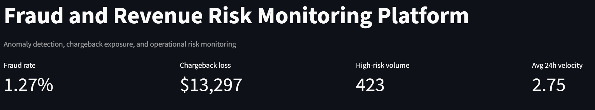
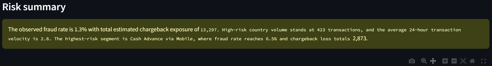
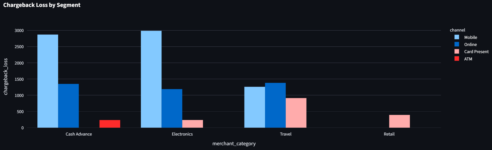
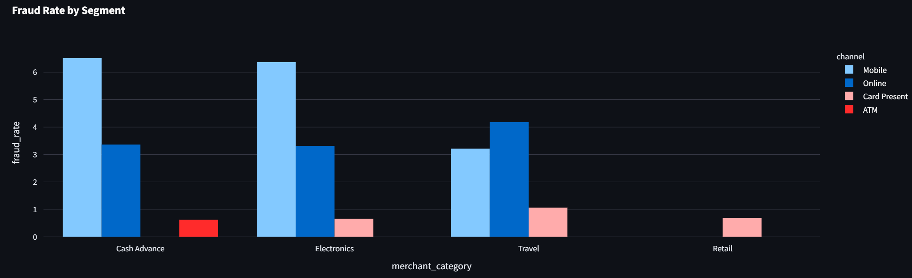
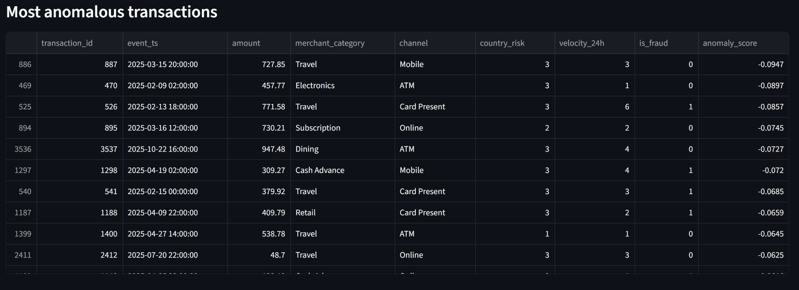

# Fraud and Revenue Risk Monitoring Platform

## Business problem
Financial organizations need to identify suspicious transaction behavior quickly while still giving business leaders clear visibility into fraud trends, chargeback exposure, and operational risk. This project demonstrates how to combine analytics engineering, anomaly detection, and executive monitoring into one reusable risk analytics solution.

## Tech stack
Python, Pandas, NumPy, scikit-learn, SQL, Streamlit, Plotly, Isolation Forest, DuckDB, Docker, GitHub Actions

## Features
- Loads transaction and fraud data
- Builds risk metrics such as fraud rate, chargeback loss, high-risk segment exposure, and suspicious velocity patterns
- Runs anomaly detection to flag unusual transactions
- Produces an executive risk dashboard
- Generates a narrative summary for leadership and operations teams

## Repository structure
```text
project_2_fraud_risk_monitor/
  app/
    streamlit_app.py
  data/
    transactions.csv
  src/
    risk_features.py
    anomaly_detection.py
    summary.py
  sql/
    schema.sql
    analyst_queries.sql
  .github/workflows/
    ci.yml
  Dockerfile
  requirements.txt
```

## Local run
```bash
pip install -r requirements.txt
streamlit run app/streamlit_app.py
```

## Summary
- Built a fraud and revenue risk monitoring platform using SQL, Python, and anomaly detection to identify suspicious transaction behavior, quantify chargeback exposure, and support faster risk review decisions.
- Developed transaction-level risk features and executive dashboards that translated fraud signals into business metrics including fraud rate, loss concentration, and high-risk segment exposure.
- Designed a GitHub-ready analytics solution with reproducible code, dashboard delivery, and business narrative generation for risk operations and leadership stakeholders.
📊 Dashboard Overview
<p align="center">  </p>

Real-time view of fraud rate, chargeback exposure, high-risk transaction volume, and transaction velocity to monitor overall platform risk.

🧠 Risk Summary Insights
<p align="center">  </p>

Automated summary highlighting key risk drivers, including high-risk segments and transaction patterns contributing to fraud exposure.

💸 Chargeback Loss by Segment
<p align="center">  </p>

Breakdown of chargeback losses across merchant categories and transaction channels, enabling identification of high-loss segments.

🚨 Fraud Rate by Segment
<p align="center">  </p>

Comparison of fraud rates across segments to identify high-risk channels such as mobile and online transactions.

🔍 Most Anomalous Transactions
<p align="center">  </p>

Top transactions ranked by anomaly score based on behavioral patterns like velocity, transaction amount, and country risk.
